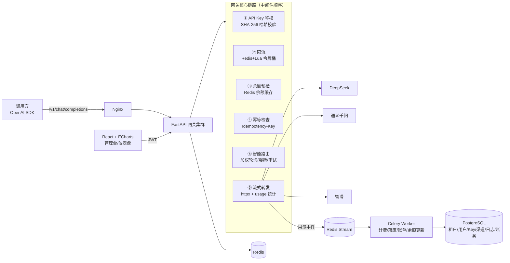

# OneHub 项目上下文（AI 开发简报）

> 本文件是自包含的项目简报：新会话读此一份即可开工，无需其他背景。
> 配套：规划背景见 `003-Project/01-岗位调研与项目方案.md`，总流程见 `003-Project/04-开发文档.md`（可选阅读）。
> 开发者：Asize（大三，软件工程，主力 JS，正学 Python/FastAPI）。

---

## 1. 项目定位

**OneHub**：OpenAI 协议兼容的多模型 LLM API 聚合网关。统一入口聚合 DeepSeek/通义/智谱渠道，提供 API Key 多租户管理、令牌桶限流、token 级异步计费、渠道负载均衡与熔断降级，配套 ECharts 监控仪表盘。

- **目的**：简历核心项目，对标**后端开发 / AI Infra / LLM Gateway** 实习岗
- **面试叙事**："讲一个你设计的高并发网关"——鉴权、限流、计费、高可用四类工程问题
- **周期**：W1–W4（2026-09-10 起的 4 周冲刺）

## 2. 技术栈（严格遵守，不引入清单外重型依赖）

| 层          | 技术                                                           |
| ----------- | -------------------------------------------------------------- |
| 后端        | Python 3.12 + FastAPI + Pydantic v2 + Uvicorn（多 worker）     |
| ORM/迁移    | SQLAlchemy 2.0（async）+ Alembic                               |
| 数据库      | PostgreSQL 16                                                  |
| 中间件      | Redis 7（令牌桶 Lua、余额缓存、幂等键）                        |
| 异步任务    | Celery + Redis（用量削峰落库、账单、渠道健康探测）             |
| HTTP 客户端 | httpx.AsyncClient（连接池、流式转发）                          |
| 前端        | React 18 + TypeScript + Vite + ECharts                         |
| 部署        | Docker Compose（api/worker/pg/redis/nginx）+ GitHub Actions CI |
| 压测        | Locust                                                         |

**验证里程碑**：OpenAI 官方 SDK 只改 base_url 指向本网关，流式/非流式均正常对话——协议兼容性的唯一标准。

## 3. 架构



## 4. 目录结构（脚手架按此生成）

```
onehub/
├── AGENTS.md               # 项目规则（W1 生成，含保护清单）
├── docker-compose.yml
├── backend/
│   ├── pyproject.toml      # uv/pip 管理，锁文件入 git
│   ├── alembic/
│   ├── app/
│   │   ├── main.py
│   │   ├── core/           # 配置(pydantic-settings)、安全(JWT/哈希)、redis 客户端
│   │   ├── models/         # SQLAlchemy 表定义
│   │   ├── schemas/        # Pydantic 请求/响应模型（OpenAI 协议模型在这里）
│   │   ├── api/
│   │   │   ├── v1/         # 网关面：gateway.py（OpenAI 兼容端点）
│   │   │   └── admin/      # 管理面：auth/keys/channels/models/dashboard
│   │   ├── services/       # limiter/router/breaker/billing/forward
│   │   ├── providers/      # base.py(抽象) + deepseek.py + qwen.py + zhipu.py
│   │   └── workers/        # Celery: billing.py / health.py
│   └── tests/              # pytest；核心算法测试与实现同周交付
├── frontend/               # React18+TS+Vite：管理台 + 仪表盘 + Playground
└── docs/
    ├── task_plan.md        # planning-with-files-zh 进度三件套
    ├── notes.md            # 每周"我学到了什么"
    ├── adr/                # 决策记录
    └── 压测与对账报告.md
```

## 5. 数据库 DDL（以此为准，Alembic 迁移生成）

```sql
CREATE TABLE tenants (id BIGSERIAL PRIMARY KEY, name VARCHAR(64) NOT NULL, created_at TIMESTAMPTZ DEFAULT now());
CREATE TABLE users (id BIGSERIAL PRIMARY KEY, tenant_id BIGINT REFERENCES tenants(id), email VARCHAR(128) UNIQUE NOT NULL, password_hash VARCHAR(128) NOT NULL, role VARCHAR(16) DEFAULT 'admin', created_at TIMESTAMPTZ DEFAULT now());
CREATE TABLE api_keys (id BIGSERIAL PRIMARY KEY, tenant_id BIGINT NOT NULL REFERENCES tenants(id), name VARCHAR(64), key_prefix VARCHAR(16) NOT NULL, key_hash CHAR(64) NOT NULL UNIQUE, rpm_limit INT DEFAULT 60, tpm_limit INT DEFAULT 100000, quota_remaining BIGINT DEFAULT 1000000, model_whitelist TEXT[], status VARCHAR(16) DEFAULT 'active', expires_at TIMESTAMPTZ, created_at TIMESTAMPTZ DEFAULT now());
CREATE TABLE channels (id BIGSERIAL PRIMARY KEY, name VARCHAR(64) NOT NULL, provider VARCHAR(32) NOT NULL, base_url VARCHAR(255) NOT NULL, api_key_encrypted TEXT NOT NULL, weight INT DEFAULT 10, status VARCHAR(16) DEFAULT 'healthy', failure_count INT DEFAULT 0, opened_at TIMESTAMPTZ, created_at TIMESTAMPTZ DEFAULT now());
CREATE TABLE models (id BIGSERIAL PRIMARY KEY, model_name VARCHAR(64) NOT NULL, channel_id BIGINT REFERENCES channels(id), input_price NUMERIC(10,6), output_price NUMERIC(10,6), enabled BOOLEAN DEFAULT true);
CREATE TABLE usage_records (id BIGSERIAL PRIMARY KEY, request_id UUID NOT NULL UNIQUE, api_key_id BIGINT REFERENCES api_keys(id), channel_id BIGINT REFERENCES channels(id), model VARCHAR(64) NOT NULL, prompt_tokens INT, completion_tokens INT, latency_ms INT, status_code INT, cost NUMERIC(12,6), created_at TIMESTAMPTZ DEFAULT now());
CREATE INDEX idx_usage_key_time ON usage_records(api_key_id, created_at);
CREATE TABLE balances (tenant_id BIGINT PRIMARY KEY REFERENCES tenants(id), balance NUMERIC(12,4) NOT NULL, version BIGINT DEFAULT 0, updated_at TIMESTAMPTZ DEFAULT now());
```

## 6. 核心算法规格（保护清单内的手写实现，按规格实现、不许换库）

### 6.1 令牌桶（Redis + Lua，单 Key RPM/TPM 双维度）

```lua
-- KEYS[1]=rate:{key_id}:{dim}  ARGV=capacity, rate/s, now, requested
local t = tonumber(redis.call('HGET', KEYS[1], 't') or ARGV[1])
local ts = tonumber(redis.call('HGET', KEYS[1], 'ts') or ARGV[3])
t = math.min(tonumber(ARGV[1]), t + (ARGV[3]-ts) * tonumber(ARGV[2]))
if t >= tonumber(ARGV[4]) then
  redis.call('HSET', KEYS[1], 't', t - ARGV[4], 'ts', ARGV[3])
  redis.call('EXPIRE', KEYS[1], 3600)
  return 1
end
redis.call('HSET', KEYS[1], 't', t, 'ts', ARGV[3])
return 0
```

超限返回 `429 + Retry-After`。全局并发用 `asyncio.Semaphore`。

### 6.2 三态熔断器（状态存 Redis 供多 worker 共享）

```
failure_count >= N(默认5) → OPEN（记 opened_at）
now - opened_at >= cooldown(30s) → HALF_OPEN（放行 1 个探测请求）
探测成功 → CLOSED（failure_count 清零）；失败 → 重新 OPEN
```

### 6.3 计费链路（时序）

```
请求 → ①鉴权 → ②限流 → ③余额预检(Redis 缓存，不查库，不足返回 402)
→ ④路由转发 + usage 统计（流式下边转发边解析 delta 累计；无 usage 用 tokenizer 估算）
→ ⑤XADD usage:{ts}（Redis Stream）
→ Celery 消费组读取 → 幂等(request_id 唯一索引) → 倍率计价
→ 乐观锁(version)更新 balances → 失效余额缓存
```

**对账标准**：50 并发请求后，Stream 事件数 == usage_records 行数，零丢失零重复；余额 == 初始 − Σcost 精确一致。

### 6.4 API 端点清单

- 网关面：`POST /v1/chat/completions`（stream 支持）、`GET /v1/models`
- 管理面：`POST /api/auth/login|register`、CRUD `/api/keys|channels|models`、`GET /api/dashboard/overview|channels`、`GET /api/usage/logs`
- 鉴权：网关面 = `Authorization: Bearer sk-...`（SHA-256 哈希校验）；管理面 = JWT

## 7. 开发计划（W1–W4，每周任务 + 验收标准）

### W1 协议兼容层 + 单渠道转发

- **任务 0（开工首日，人工介入点）**：spec-kit 走 /specify → **/clarify（问题列出等开发者亲自回答，禁止代答）** → /plan → /tasks；writing-for-agents 生成 AGENTS.md；planning-with-files-zh 建三件套
- 脚手架：FastAPI + SQLAlchemy + Alembic + compose（pg/redis）——验收：`docker compose up` 后 /docs 可访问
- OpenAI 兼容端点 + DeepSeek Provider（design-an-interface 出两版候选接口对比后定稿）——验收：**OpenAI SDK 改 base_url，流式/非流式均能对话**
- SSE 流式透传 + delta 累计 usage——验收：流式结束 usage 事件有 token 数
- **teach 检查点**：FastAPI async、Pydantic/OpenAPI、适配器模式、httpx、SSE 转发

### W2 多租户鉴权 + 限流

- 租户-用户-Key 三级模型 + 管理端 JWT；SK- Key 生成/哈希存储/模型白名单
- 鉴权中间件（哈希校验→状态/白名单/过期）——验收：全分支单测
- 令牌桶（Lua）+ Semaphore——验收：超限 429+Retry-After，并发单测无竞态（dev-tdd 先写测试）
- 幂等键支持——验收：重复请求不重复转发
- **teach 检查点**：API Key 体系、限流四算法、Redis 原子性/Lua、幂等
- 📌 **简历上墙点 1**：简版上简历（协议兼容+鉴权+限流）
- 安全专项：security-best-practices 审查

### W3 计费引擎

- models 定价表 CRUD；余额预检（Redis）；用量事件 → Redis Stream → Celery 异步落库
- 并发扣减：乐观锁 + 失败重试——验收：**对账脚本通过（见 6.3 标准）**
- **teach 检查点**：幂等、事务隔离级别、并发扣减三方案对比、消息队列削峰

### W4 智能路由 + 管理台 + 压测

- 加权轮询 + 指数退避重试（含抖动）；三态熔断器——验收：手动封禁主渠道自动切备用、恢复后切回
- React 管理台 + ECharts 仪表盘；Playground 页（dogfood 通过）
- Locust 压测：200 并发流式 5min——验收：错误率 <1%，记录 P95
- **teach 检查点**：重试策略、熔断器、负载均衡、CI/部署
- 📌 **简历上墙点 2**：完整版上简历（压测数字入 R 部分）

## 8. AI 工作规则（每会话生效）

### 8.1 流程

1. 每次会话开始：先读 AGENTS.md 与 docs/task_plan.md，同步进度后再动手
2. 周初：dev-grill-docs / dev-plan 出周计划，**等开发者确认后**才写代码
3. 核心算法（令牌桶/熔断/计费幂等/路由）：**dev-tdd 先写测试再实现**
4. 生成代码全程遵守 karpathy-guidelines：最小改动、不过度工程、不投机抽象
5. 完工：webapp-testing 自动验收 + dev-verify 拿命令证据（禁止口头"完成"）
6. dev-code-review 审查 + ponytail-review 剪意外复杂度（保护清单豁免）+ dev-commit-writer 提交（Conventional Commits）

### 8.2 保护清单（简历卖点，手写实现，禁止替换成熟库，ponytail/security 审查豁免）

- 手写 Redis+Lua 令牌桶（不用 redis-cell 等模块）
- 手写三态熔断器（不用 pybreaker）
- 计费幂等与乐观锁扣减自实现
- SSE 流式透传与 usage 解析自实现

### 8.3 禁改清单

- `.env` / `.env.example` 之外的真实密钥文件：永不入 git
- `alembic/versions/` 已生成的迁移：只增不改
- `docs/task_plan.md`：只按实际进度更新，不虚构完成状态

### 8.4 停机点（必须停下等人工，禁止自动继续）

1. spec-kit /clarify 的问题——开发者亲自回答
2. 周计划产出后——开发者确认
3. 遇到架构级决策（新增外部依赖/改 DDL/改目录结构）——先记 ADR 提案，等人批

## 9. 环境与密钥（开工前人工准备）

- Docker Desktop、Python 3.12、Node 20 + pnpm、Locust
- `.env`：`DEEPSEEK_API_KEY`（必）、`QWEN_API_KEY`/`ZHIPU_API_KEY`（W4 多渠道用）、`DATABASE_URL`、`REDIS_URL`、`SECRET_KEY`
- LLM 渠道：DeepSeek 开放平台（主）；通义/智谱（演示路由降级用）
